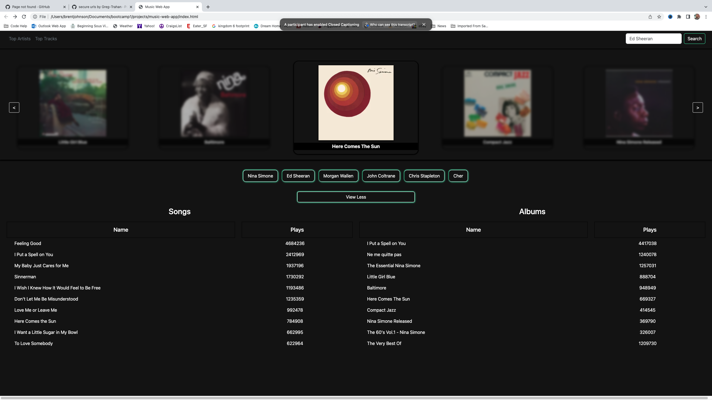

#  Music Web App

## Description

The following application presents the user with an interactive webpage to search for a music artist.  It will then pull up the artists top albums and tops songs. When the artist is found, a dyanmicaly created slide of the artist album covers is displayed where the user can scroll through and select an album to see its song titles and then click on a song to go to another webpage where the song can be played.  Other functionality includes menu items to allow user to search for most popular songs and albums amongst all artist, as well as a history of most recently searched artists.

## Technologies Used

Html, javascript, css, jquery, bootstrap, and use of 3rd party api from last.fm.

## Collaberators
Greg Trahan, Zach Shouts, Cong Thanh Pham, Mugess Khaki, Brent Johnson

## Mock-Up

The following image shows the web application's appearance and functionality:

## Deployed

[Click here for deployed music app](https://zachshouts.github.io/music-web-app/)
- - -
© 2022 edX Boot Camps LLC. Confidential and Proprietary. All Rights Reserved.
